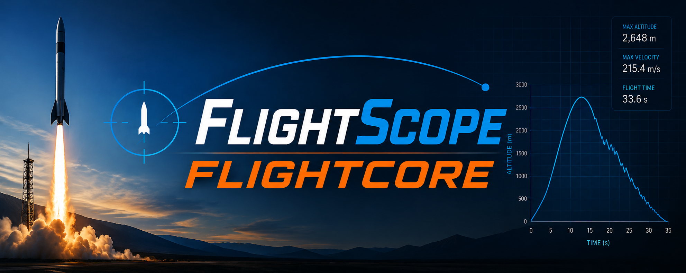

# FlightScope FlightCore



The embedded flight computer powering FlightScope, designed to autonomously record high-frequency rocket telemetry for post-flight analysis.

---

# FlightScope Dashboard

Telemetry recorded by FlightCore can be visualized using the FlightScope desktop dashboard.

**Dashboard Repository:** https://github.com/zombieking1555/FlightScope

---

# Quick Start

## Hardware

Connect:

* Raspberry Pi Pico 2
* Adafruit LSM6DSO32 IMU
* Adafruit BMP388 Barometric Sensor
* MicroSD Card Breakout
* 3.7V LiPo Battery

## Software

Clone the repository:

```bash
git clone https://github.com/zombieking1555/FlightScope-FlightCore.git
cd FlightScope-FlightCore
```

Build and upload with PlatformIO:

```bash
pio run
pio run --target upload
```

Insert a formatted microSD card, power the flight computer, and FlightCore will automatically wait for launch.

---

# Features

* Automatic launch and landing detection
* High-rate IMU and barometric altitude logging
* CSV telemetry logging directly to microSD
* Buffered pre-launch telemetry capture using a ring buffer
* Modular sensor architecture for easy expansion
* Designed specifically for seamless integration with the FlightScope analysis dashboard

---

# Hardware

FlightCore currently supports:

| Component                 | Purpose                    |
| ------------------------- | -------------------------- |
| Raspberry Pi Pico 2       | Main flight computer       |
| Adafruit LSM6DSO32        | 6-axis IMU                 |
| Adafruit BMP388           | Barometric altitude sensor |
| Adafruit MicroSD Breakout | Telemetry storage          |
| LiPo Battery              | Power source      |

Future revisions are intended to add support for additional sensors such as GPS, magnetometers, and wireless telemetry.

---

# Running Locally

## Requirements

* PlatformIO
* VS Code (recommended)
* Raspberry Pi Pico 2
* Python is **not** required for FlightCore itself. To additionally run FlightScope. see FlightScope's [Github Documentation](https://github.com/zombieking1555/FlightScope).

Clone the repository:

```bash
git clone https://github.com/zombieking1555/FlightScope-FlightCore.git
```

Open the project in VS Code with the PlatformIO extension installed.

Compile:

```bash
pio run
```

Upload:

```bash
pio run --target upload
```

Monitor serial output:

```bash
pio device monitor
```

---

# How It Works

FlightCore is designed around one thing:

> Power on before launch, and record flight unti landing.

Once powered, the firmware continuously samples onboard sensors and checks for flight events such as liftoff and landing. When launch acceleration exceeds the configured threshold, FlightCore begins writing telemetry to the microSD card, first flushing a pre-launch data buffer before recording the remainder of the flight.

Throughout flight, data from the IMU and barometric sensor are timestamped into a CSV file. After landing is detected, logging automatically stops and the file is closed, allowing it to be imported directly into the FlightScope dashboard for visualization, analysis, and comparison.

The firmware is organized into independent modules for sensors, logging, flight-state detection, and storage, making it straightforward to extend with additional hardware in future revisions.

---

# Project Structure

```
FlightCore/
│
├── include/          Header files
├── src/              Firmware source code
├── lib/              Reusable libraries
├── test/             Unit tests
├── platformio.ini    PlatformIO configuration
└── README.md
```

---

# FlightScope Ecosystem

FlightCore is one half of the complete FlightScope ecosystem.

**FlightCore**

* Collects flight telemetry
* Stores data on a microSD card
* Runs onboard the rocket

**FlightScope Dashboard**

* Imports telemetry logs
* Visualizes altitude, velocity, acceleration, orientation, and trajectory
* Renders 3D rocket orientation
* Compares flights
* Exports videos and analysis

---

# Contributing

Contributions, suggestions, and feature requests are welcome. Feel free to open an issue or submit a pull request.

---

# License

This project is licensed under the MIT License, in addition to Adafruit software licenses. See `LICENSE.md` for details.

---

# Acknowledgements

* Adafruit Industries for sensor breakout boards and Arduino libraries
* Raspberry Pi Foundation for the Pico 2 platform
* PlatformIO for the embedded development environment
* The model rocketry community for inspiration and testing
